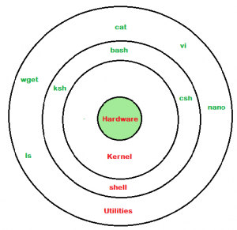

# Let's get started!

## Linux commands:

### Easy (gotta know)
- man (manual) : manual user guide
> **_NOTE:_**  Please do read the guide before using anything, otherwise stop blaming
- cd (change directory)
- ls (list)
- cp (copy)
- mv(move) : to move/remove file(s)
> **_NOTE:_**  Everything in Linux is file (regular file, directory, etc.)
- rm : remove file(s)
- pwd : print name of current/working directory
- cat : concatenate files and print on the standard output
- grep (global regular expression print) : print lines that match patterns
- echo : display a line of text
- ps: proc stat
- top/htop: like ps but adding more animation like Window Task Manager
- kill : kill a process by PID
### Medium (could know)
- wget : download file(s) and only support HTTP, HTTPS and FTP
- curl : download file(s) and supports FTP, FTPS, Gopher, HTTP, HTTPS, SCP, SFTP, TFTP, TELNET, DICT, LDAP, LDAPS, FILE, POP3, IMAP, SMB/CIFS, SMTP, RTMP and RTSP
> **_NOTE:_**  I copied the info from internet, don't ask me how comes I know
- ssh (Secure Shell or Secure Socket Shell) : to let you access to another computer and work on CLI (Command Line Interface)
- scp : is a friend of ssh, using ssh connection to transfer the file
- sort
- uniq
- wc : word count
- df : disk free
- du : disk usage
- ln : create shortcut to a file
- diff
- tar/zip/unzip/7za
- less/more : display the contents of a file in a terminal and let you interact without messing the current terminal. It means that the output of less/more will be disappeared after exitting
- tail/head : display a number of lines in head/tail of file, 
> **_NOTE:_** yes, it's like 'cat', but 'cat' displays all content of file which could mess up your terminal
- clear : to clear the messy terminal

### Hard (good to know)

- xargs : build and execute command lines from standard input
- cut
- column
- sed (stream editor) : for filtering and transforming text
- awk (by Aho, Weinberger, Kernighan)

## Linux command examples:
Let's combine the command to get wonderful work. Your new friends now are 

> https://explainshell.com/

> https://chatgpt.com/

1. Multiple patterns grep
> git ls-files | grep '\\.cpp\|\\.h'

or

> git ls-files  | grep -e '\\.cpp' -e '\\.h'

2. To get all .cpp and .h, then count how many line the file has
> $ git ls-files  | grep -e '\\.cpp' -e '\\.h'  | xargs wc -l | sort -n

3. Remove trailing space:
> $ git ls-files  | grep -e '\\.cpp' -e '\\.h' |xargs sed -ri 's/\\s+\$//'

4. Kill process if found
> $ ps aux | grep processAAA | awk '{print $1}' | xargs kill -9

5. Count how many time the pattern appears in .xml file in current directory
> $ grep aaa *.xml | uniq -c

6. disk free check
> df -h | grep home

7. disk usage check (only recursive 1 level)
> du -h --max-depth=1

8. Replace the pattern AAA to BBB in all files in current and sub directory
> grep -rl AAA | xargs sed -ri 's/AAA/BBB/'

## Regex (Regular Expression):
New friend https://regex101.com/

# Shell scripting
## What is Linux shell
1. is a special user program that provides an interface for the user to use operating system services.
2. Shell accepts human-readable commands from users and converts them into something which the kernel can understand

## Type of shell:
1. BASH (Bourne Again SHell) It is the most widely used shell in Linux systems
2. CSH (C SHell) – The C shell’s syntax and its usage are very similar to the C programming language.
3. KSH (Korn SHell) – The Korn Shell was also the base for the POSIX Shell standard specifications etc.

> **_NOTE:_**  We use Terminal to interact with shell

## Shell scripting:
1. is set of command which is organized on purpose
2. any commands you use, you can put in script
3. to do automation tasks
> **_NOTE:_** Scripting is large and nessessary for human, we do have high level scripting like Python, but Shell is integrated in every single system, but not Python

## How script looks like
> #!/bin/bash echo "Hello world"

(hello.sh)

above script has 2 lines:
1. first line for shebang which tells the executer that please use 'bash' to execute my script, otherwise executer will take your current shell type to do instead and could cause the syntax error among shells.
2. second line is to print out text to console

## How to execute
> $ sh hello.sh

or

> $ chmod 755 hello.sh \$ ./hello.sh Hello world

the script can run under background by putting '&' at the end

> $ sh hello.sh & [1] 123

## Comment
> #!/bin/bash 
#i'm human, i comment for complex code 
echo "Hello world" 

(hello.sh)

## Variable
You can assign the value to a variable by

> $ ABC="123 dzo 123 dzo 23 uong"

> **_NOTE:_**  Do not add more white space before and after '='

or a return value of a command by

> $ ABC=\$(ls) 
> \$ ABC=\$(cat)

Variable scrope : global scope by default, define before use

> #!/bin/bash 
function hello 
{ 
    &nbsp;&nbsp;&nbsp;&nbsp; A="AAA" 
    &nbsp;&nbsp;&nbsp;&nbsp; echo "Hello world" 
} 
hello 
echo $A 

output
>Hello world 
AAA

although you see that A is defined within hello(), but :)))

if you mean var A only in hello(), add local 

> #!/bin/bash 
function hello 
{ 
    &nbsp;&nbsp;&nbsp;&nbsp; local  A="AAA" 
    &nbsp;&nbsp;&nbsp;&nbsp; echo "Hello world" 
} 
hello 
echo $A 

output
>Hello world 
#a blank line here because there is not var A defined yet

## IF statement

> if [ condition-is-true ] 
then 
&nbsp;&nbsp;&nbsp;&nbsp; command 1 
&nbsp;&nbsp;&nbsp;&nbsp; command 2 
elif [ condition-is-true ] 
then 
&nbsp;&nbsp;&nbsp;&nbsp; command 3 
else 
&nbsp;&nbsp;&nbsp;&nbsp; command 4 
fi

> **_NOTE:_**  Add one more white space after '[' and before ']'

New friend comes bro: https://devhints.io/bash

## FOR statement

> for val in A B C 
do 
&nbsp;&nbsp;&nbsp;&nbsp; echo $val 
done

## Argument passed in

> $ sh hello.sh Kitty Poro

To access 1st arg -> $1

To access 2nd arg -> $2

Max access is $9

Print all args -> $@

## Exit code

from 0-255

0 is OK

[1-255] is NOK

To get exit code of last executed command
> $ echo \$?

## Function (define before use) 

### How it looks like

> function foo() 
{ 
&nbsp;&nbsp;&nbsp;&nbsp;  foo1 
&nbsp;&nbsp;&nbsp;&nbsp;  foo2 
} 

or 
> bar() 
{ 
&nbsp;&nbsp;&nbsp;&nbsp;  vui vay thoi chu bar dan con nay 1 
&nbsp;&nbsp;&nbsp;&nbsp;  vui vay thoi chu bar dan con nay 2 
} 

### Call a function
> function foo() 
{ 
&nbsp;&nbsp;&nbsp;&nbsp;  foo1 
&nbsp;&nbsp;&nbsp;&nbsp;  foo2 
} 
 
#without function specifier, here is main entry 
#without parameter 
foo  
#with parameter 
foo arg1 arg2 

### Function exit code
go with return 

> function foo() 
{ 
&nbsp;&nbsp;&nbsp;&nbsp;  foo1 
&nbsp;&nbsp;&nbsp;&nbsp;  if [ condition-is-true ] 
&nbsp;&nbsp;&nbsp;&nbsp;&nbsp;&nbsp;&nbsp;&nbsp;  return 0 
&nbsp;&nbsp;&nbsp;&nbsp;  else  
&nbsp;&nbsp;&nbsp;&nbsp;&nbsp;&nbsp;&nbsp;&nbsp;  return 1 
} 
 
#without function specifier, here is main entry 
#without parameter 
foo  
#print exit code 
echo $?
